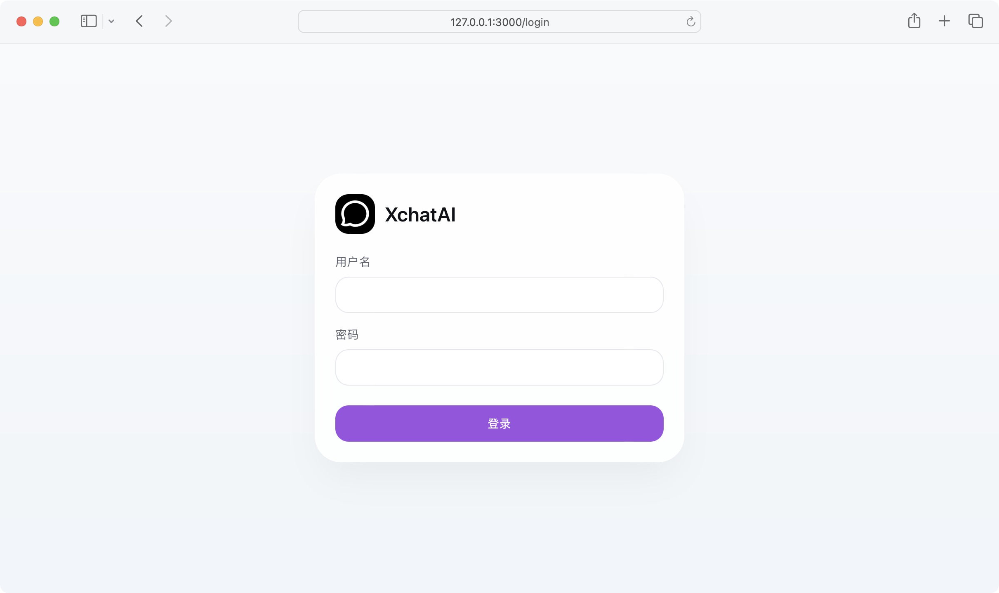
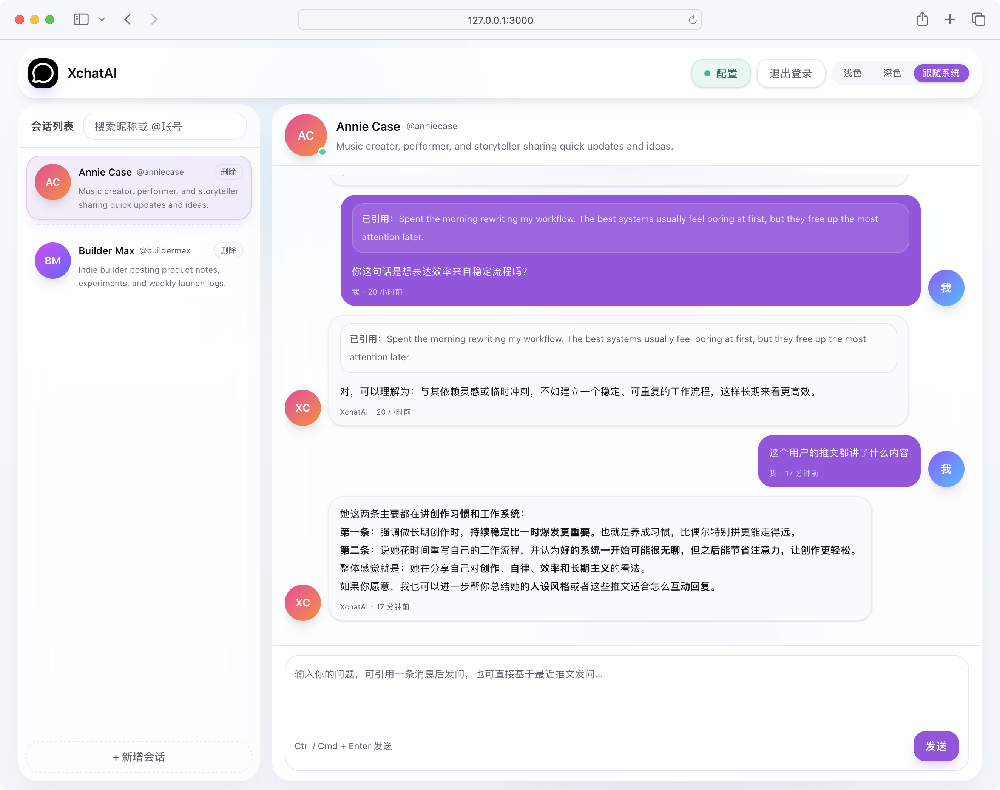
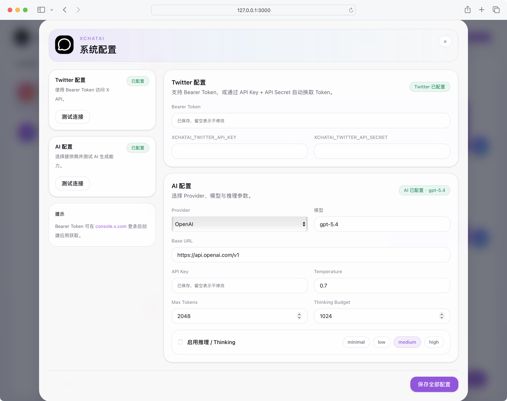
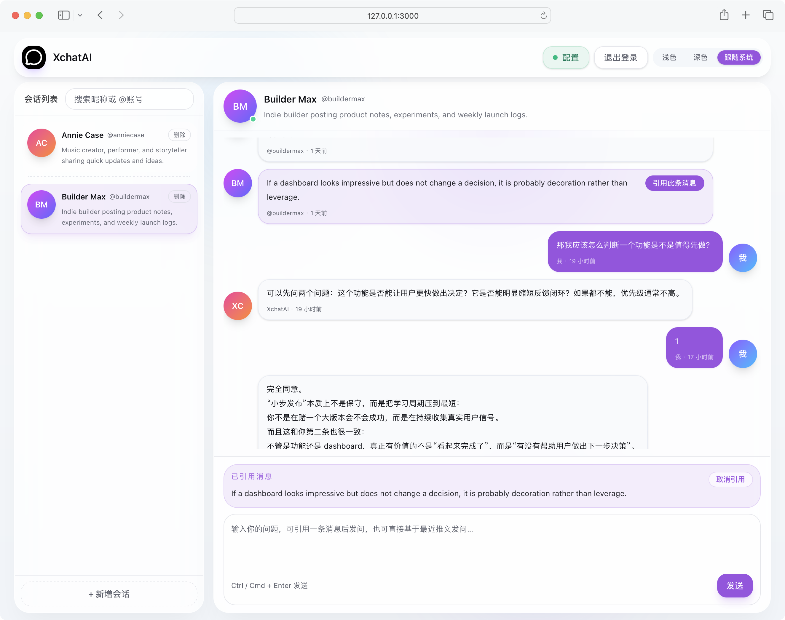

# XchatAI

A **Next.js 16 + React 19 + TypeScript** project for Twitter/X profile analysis and AI-powered chat.

[中文 README](./README.md)

Core capabilities:

- Fetch a Twitter/X user's profile and recent tweets
- Start AI conversations based on tweet context
- Ask questions by quoting a specific tweet
- Configure multiple AI providers such as OpenAI / Claude / Gemini / Qwen
- Persist conversation data as local files
- Require login for all system pages and APIs by default

---

## Screenshots

### Login Page



### Workspace Home



### Config Dialog



### Chat Window / Quoted Tweet



---

## Features

### Feature Summary

| Module | Description |
| --- | --- |
| Authentication | All pages and APIs are protected by default and redirect to `/login` when unauthenticated |
| Conversation Management | Search, create, delete, and paginate conversations |
| AI Chat | Chat based on Twitter/X tweet context, with quoted tweets and streaming replies |
| Configuration | Manage Twitter/X and AI settings from the frontend |
| Local Storage | Conversations are stored as local JSON files and runtime config is stored in `.env` |

### Authentication & Access Control

- All system pages require login by default
- All `/api/*` endpoints require login by default
- Unauthenticated page access redirects to `/login`
- Unauthenticated API access returns `401`, and the frontend redirects to the login page
- Login credentials are loaded from `.env`
- Passwords are validated against an **MD5** hash configured on the server

### Conversations & Chat

- Conversation list in the left sidebar
- Search conversations
- Create a conversation by entering a Twitter/X username
- Delete conversations
- Paginate and load more history
- Conversation context is built from the target account's tweets
- Ask questions by quoting a specific tweet
- AI responses are streamed via **SSE**
- Load older messages with pagination
- Chat messages support Markdown rendering

### Configuration & Storage

- Configure and save the following from the frontend:
  - Twitter/X Bearer Token
  - Twitter/X API Key / API Secret
  - AI Provider
  - Base URL
  - Model
  - Temperature
  - Max Tokens
  - Thinking parameters
- The final configuration is written to the server-side `.env`
- Conversations are stored at `data/conversations/<conversationId>/conversation.json`
- Runtime configuration is stored in the root `.env`

---

## Tech Stack

- **Frontend**: Next.js 16, React 19, TypeScript, Tailwind CSS 4
- **State Management**: Zustand
- **Markdown Rendering**: react-markdown, remark-gfm
- **AI SDK**: Vercel AI SDK (`ai`)
- **AI Providers**: OpenAI / Anthropic / Google / Qwen-compatible APIs
- **Server Runtime**: Next.js App Router + Route Handlers
- **Auth**: Server-signed session cookie
- **Persistence**: Local JSON files

---

## Project Structure

```text
xchatai/
├─ app/                         # Pages and API routes
│  ├─ api/
│  ├─ login/
│  ├─ layout.tsx
│  └─ page.tsx
├─ components/                  # UI components
│  ├─ auth/
│  └─ xchatai/
├─ data/                        # Local conversation data
├─ lib/
│  ├─ hooks/                    # Frontend business hooks
│  ├─ server/
│  │  ├─ auth/                  # Session and auth logic
│  │  ├─ providers/             # AI / Twitter provider adapters
│  │  ├─ services/              # Service layer
│  │  ├─ storage/               # Local file storage
│  │  └─ validators/            # Request validators
│  ├─ services/                 # Frontend HTTP clients
│  ├─ store/                    # Zustand stores
│  └─ types/                    # Shared types
├─ public/                      # Static assets
├─ docs/                        # Docs and screenshot assets
├─ proxy.ts                     # Access guard
├─ .env                         # Server config
├─ README.md
└─ README.en.md
```

---

## Quick Start

### 1. Install dependencies

```bash
pnpm install
```

### 2. Configure environment variables

Create a `.env` file in the project root:

```env
# Auth
XCHATAI_AUTH_USERNAME="demo"
XCHATAI_AUTH_PASSWORD_MD5="c710ac795e1cd0c8648cb83cbdcf6152"
# Optional: custom session signing secret
XCHATAI_AUTH_SESSION_SECRET="replace-with-your-own-secret"

# AI
XCHATAI_AI_PROVIDER="openai"
XCHATAI_AI_BASE_URL="https://api.openai.com/v1"
XCHATAI_AI_API_KEY="your-api-key"
XCHATAI_AI_MODEL="gpt-4.1-mini"
XCHATAI_AI_TEMPERATURE="0.7"
XCHATAI_AI_MAX_TOKENS="2048"
XCHATAI_AI_ENABLE_THINKING="false"
XCHATAI_AI_THINKING_BUDGET="1024"
XCHATAI_AI_THINKING_LEVEL="medium"

# Twitter / X
XCHATAI_TWITTER_BEARER_TOKEN="your-bearer-token"
XCHATAI_TWITTER_API_KEY="your-api-key"
XCHATAI_TWITTER_API_SECRET="your-api-secret"
XCHATAI_TWITTER_ACCESS_TOKEN="your-access-token"
XCHATAI_TWITTER_ACCESS_SECRET="your-access-secret"
```

### 3. Start development server

```bash
pnpm dev
```

Default URL:

```text
http://localhost:3000
```

### 4. Production build

```bash
pnpm build
pnpm start
```

---

## Authentication Configuration

The login system depends on these two variables:

```env
XCHATAI_AUTH_USERNAME="demo"
XCHATAI_AUTH_PASSWORD_MD5="<md5-of-your-password>"
```

### How to generate an MD5 password hash

#### macOS
```bash
echo -n 'your-plain-password' | md5
```

#### Linux
```bash
echo -n 'your-plain-password' | md5sum
```

#### Node.js
```bash
node -e "console.log(require('crypto').createHash('md5').update('your-plain-password').digest('hex'))"
```

> Users enter the **plain-text password** on the login page. The server hashes it with MD5 and compares it with the value stored in `.env`.

---

## Usage Flow

### 1. Login
- If not authenticated, the app redirects to `/login`
- Enter the username from `.env` and the matching plain-text password

### 2. Configure AI / Twitter
- On first entry, the config dialog opens automatically if required settings are missing
- Fill in the Twitter/X and AI settings and save them

### 3. Create a conversation
- Enter a target Twitter/X username in the left sidebar
- The system fetches the profile and recent tweets, then creates a local conversation

### 4. Start chatting
- Ask a question directly
- Or quote a specific tweet before asking
- Responses are streamed in real time

## Local Data Example

Example conversation file:

```json
{
  "id": "test-user-001",
  "name": "Annie Case",
  "handle": "anniecase",
  "bio": "Music creator, performer, and storyteller.",
  "messageCount": 8,
  "messages": [
    {
      "id": "tweet-1",
      "role": "tweet",
      "content": "A short reminder...",
      "createdAt": "2026-04-13T02:08:14.757Z"
    },
    {
      "id": "msg-1",
      "role": "user",
      "content": "What does this tweet actually mean?",
      "createdAt": "2026-04-13T06:08:14.757Z"
    },
    {
      "id": "msg-2",
      "role": "assistant",
      "content": "It can be understood as...",
      "createdAt": "2026-04-13T06:09:14.757Z"
    }
  ]
}
```

---

## License

This project is released under the **Apache License 2.0**.

- License file: [`LICENSE`](./LICENSE)
- You may use, modify, distribute, and use this project commercially, subject to the terms of Apache-2.0
